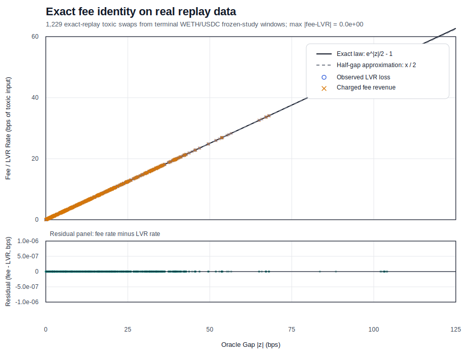
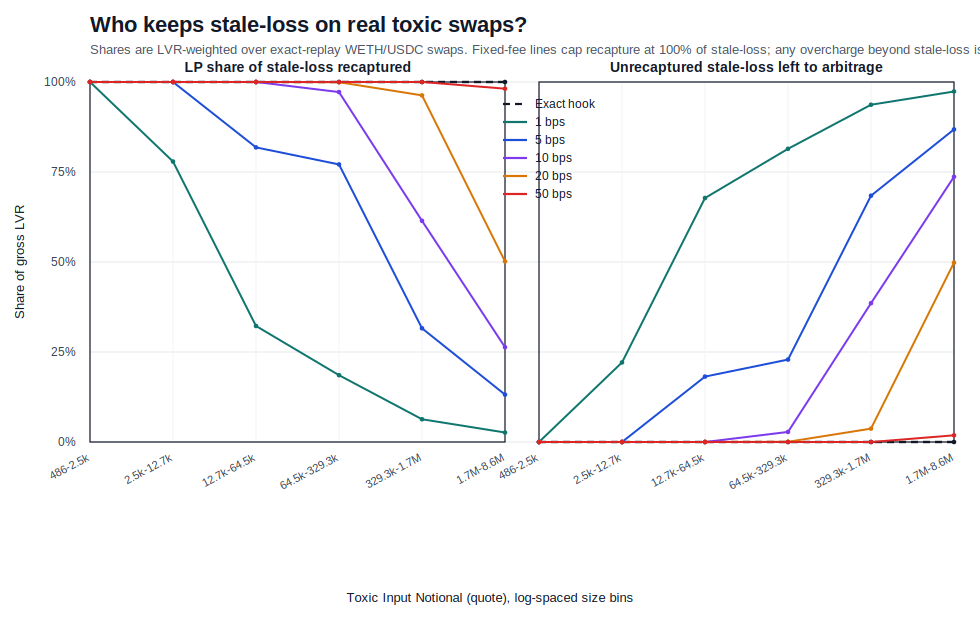

# uni-v4-hook

`uni-v4-hook` is a Foundry research repo for an oracle-anchored Uniswap v4 hook that targets loss-versus-rebalancing (LVR) on stale pools with dynamic toxic-flow fees, oracle freshness checks, LP width/centering guards, and an optional Dutch-auction repricing path.

## 30-Second Proof

**Fee identity holds to machine precision on real data.**

Across `44` replay-clean frozen windows (`7,019` swaps), every exact-replay fee-identity check passed. Maximum residual error on the exact series was `1.0e-64`.



The identity chart proves the accounting claim. The next chart answers the economic question: for real toxic swaps, how much stale-loss goes back to LPs versus remaining with arbitrageurs across swap sizes and fee schedules?



| Policy | Toxic-flow handling | 44-window result |
| --- | --- | --- |
| Baseline (`5 bps` fixed fee) | Flat fee, independent of oracle gap. | Underperforms the hook in `44 / 44` windows; median LP delta vs hook = `-2,652.39` quote. |
| Oracle-anchored hook | Charges the exact stale-loss recovery premium on toxic flow. | Reference policy for the study; fee identity passed in all `44 / 44` replay-clean windows. |
| Dutch auction | Only opens when solver execution beats the hook counterfactual. | Mean LP uplift vs hook = `+3.40` quote, 95% CI `[+0.93, +5.99]`; positive / zero / negative = `21 / 23 / 0`; mean trigger rate = `1.21%`. |

## Key Results

- Exact toxic-flow surcharge law: `f*(z) = e^{|z|/2} - 1`, with `z = log(P_ref / P_pool)`.
- The fee-identity claim is no longer hypothetical in this repo: the replay pipeline and exact-fee pass agree to machine precision on frozen real data.
- The current Dutch-auction policy is positive versus hook in `21` windows, zero in `23`, and negative in `0`.
- The October 2025 v4 refresh completed `124 / 124` planned pool-windows across WETH/USDC, WBTC/USDC, LINK/WETH, and UNI/WETH.
- Auction eligibility is now the pool-oracle stale gap in bps: `stale_gap_bps_before >= trigger_gap_bps`.
- The recommended grid cell is `trigger_gap_bps=10`, `base_fee_bps=5`, `start_concession_bps=10`, `concession_growth_bps_per_sec=0.5`, and `max_fee_bps=2500`.
- The main remaining question is execution generalization, not fee accounting: the month grid is adversarial/informed-flow evidence, while competitive routing and mixed-flow pending-auction behavior remain future work.

## Research Results

For a concise explanation of how the month-scale study was set up, read [docs/research_results.md](docs/research_results.md). The draft paper source is [lvr_v4_hook_paper_dutch_auction.tex](lvr_v4_hook_paper_dutch_auction.tex).

## Policies Tested

The Dutch-auction study separates baseline strategies from auction trigger rules and parameter schedules. The main strategy families tested were:

| Strategy family | What it does | Why it is included |
| --- | --- | --- |
| Unprotected / no-auction baseline | Repricer moves the pool back to the reference price with no auction protection. | Measures gross LP loss / LVR to recapture. |
| Fixed-fee baseline | Repricer pays the normal pool fee tier. | Shows what static fees capture without dynamic toxicity pricing. |
| Hook-only exact toxic-flow fee | Exact toxic-flow fee applies, but no Dutch auction opens. | Negative control: exact fees can deter repricing and leave the pool stale. |
| Hook + Dutch auction | Auction opens under a trigger rule and clears only if solver economics and LP reserve constraints are met. | Candidate mechanism for preserving repricing while returning stale-loss surplus to LPs. |

Current auction trigger rules tested in the simulator:

| Trigger rule | Fires when | Where used |
| --- | --- | --- |
| `stale_gap_bps_before` | Current pool-oracle stale gap is at least `trigger_gap_bps`. | Main October 2025 v4 grid. |
| `hook_lp_net_negative` | Hook-only counterfactual LP net would be negative: `hook_fee_revenue - gross_lvr < 0`. | October 10 four-pool stress exhibit. |
| `fee_too_high_or_unprofitable` | The hook would fail closed or leave no public-searcher profit. | Robustness / diagnostic sweep. |
| `all_toxic` | Every toxic correction above the stale-loss floor is auction eligible. | Upper-bound / diagnostic sweep. |

The selected month policy uses the stale-gap bps gate and reports recapture, clear rate, and solver payout in rate units. Solver gas, solver edge, and reserve margin are zero in this counterfactual, so this is a research benchmark rather than production solver economics.

## What the Hook Does

`src/OracleAnchoredLVRHook.sol` implements two controls:

- `beforeSwap`: reads a fresh oracle price, classifies toxic direction, and overrides the LP fee.
- `beforeAddLiquidity`: rejects LP ranges that are too narrow or too far off-center relative to the oracle.

Core mechanics:

- benign flow pays the base fee; toxic flow pays a gap-scaled surcharge, and the swap fails closed if the computed fee exceeds `maxFee`
- swaps and fee previews fail closed when the oracle is stale
- the hook tracks oracle volatility through an EWMA-style `sigma^2` update
- LP admission uses width and centering guards derived from oracle risk

`src/oracles/ChainlinkReferenceOracle.sol` supplies the reference price, either from one Chainlink feed or a base/quote ratio assembled from two feeds.

## Quick Start

Requires Foundry and Python 3.

Build and run the core test suites:

```bash
forge build
forge test
python3 -m unittest discover -s script -p 'test_*.py'
```

Regenerate the proof artifacts shown above:

```bash
python3 -m script.generate_one_page_proof
```

Fork tests and live historical export need `MAINNET_RPC_URL`.

## Repository Layout

- `src/`: hook, oracle, and interfaces
- `test/`: Foundry unit, fuzz, invariant, property, and fork tests
- `script/`: Python export, replay, backtest, reporting, and artifact-generation code
- `study_artifacts/`: frozen proof artifacts and replay-clean study outputs

## Open Questions

- Improve external-reference selection for alt pools so multi-oracle ranking is informative outside the core WETH/USDC families.
- Test how robust the current auction trigger / reserve policy remains out of sample once broader alt-pool windows with nonzero triggers are identified.
- Extend the auctioned agent study to mixed flow so benign execution cost, stale-time, and volume rejection can be reported alongside LP recapture.

## Further Reading

- [docs/research_results.md](docs/research_results.md)
- [study_artifacts/one_page_proof_2026_03_31/README.md](study_artifacts/one_page_proof_2026_03_31/README.md)
- [study_artifacts/dutch_auction_ablation_2026_03_28/README.md](study_artifacts/dutch_auction_ablation_2026_03_28/README.md)
