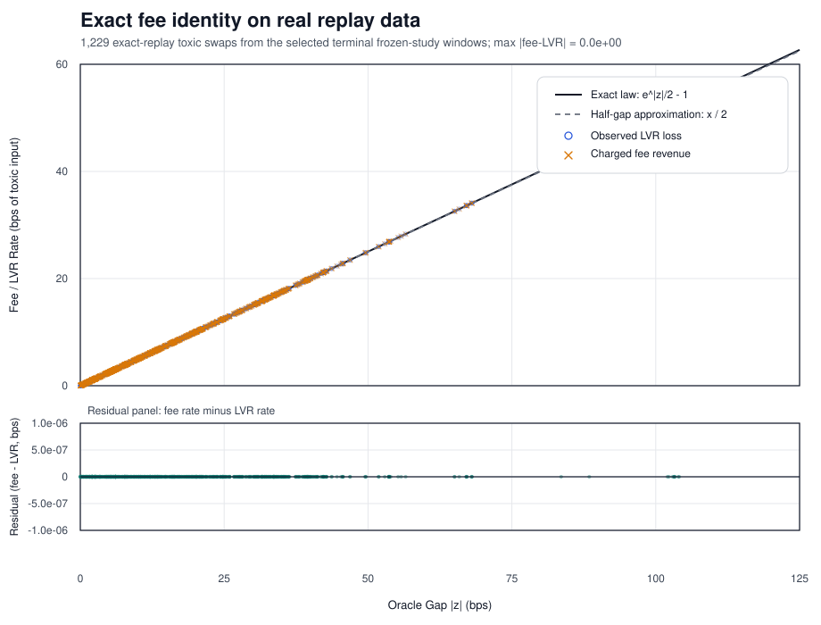
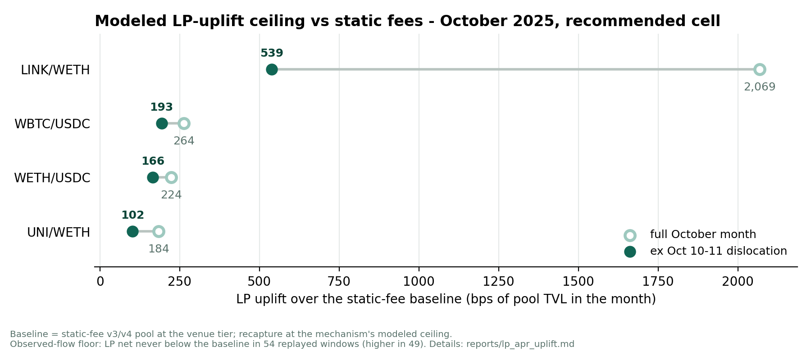

# uni-v4-hook

`uni-v4-hook` is a Foundry research repo for an oracle-anchored Uniswap v4 hook that targets loss-versus-rebalancing (LVR) on stale pools with dynamic toxic-flow fees, oracle freshness checks, LP width/centering guards, and an on-chain Dutch-auction repricing path (a gap-triggered, time-growing concession on the toxic surcharge).

**Live instrument:** [lvr-minimizer.vercel.app](https://lvr-minimizer.vercel.app) —
a real-time dashboard over the live Base Sepolia USDC/WETH deployment: stale-gap
gauge, fee previews, Dutch-auction state, wallet-driven pool operation, and a raw
EVM bus inspector logging every call, return, revert, and event the page touches
(source in [site/](site/)).

## Current Research Draft

The current shareable draft is:

- [LVR_v4_hook_research.pdf](LVR_v4_hook_research.pdf)

The reproducible research bundle for that draft lives in [reports/](reports/). The most useful entry points are:

- [reports/parameter_set_outcomes.md](reports/parameter_set_outcomes.md): what parameter sets were tried and how they performed.
- [reports/sensitivity_impact_table.md](reports/sensitivity_impact_table.md): one-step parameter sensitivity.
- [reports/solver_economics_table.md](reports/solver_economics_table.md): solver payout scale in USD terms.
- [docs/research_results_v2.md](docs/research_results_v2.md): concise methodology and results summary.
- [reports/evidence_release.md](reports/evidence_release.md): frozen 2026-08-03 public-claim source, including measured-regime exclusions and threshold sensitivity.
- [docs/system_backtest_flow.md](docs/system_backtest_flow.md): system and backtest flow.

## Fee-Law Validation

The Dutch-auction study depends on the hook fee law being correct. The one-page proof artifacts validate that accounting layer separately from the auction parameter grid.

Across `44` replay-clean frozen windows (`7,019` swaps), every exact-replay fee-identity check passed. Maximum residual error on the exact series was `1.0e-64`.



The fee-identity chart proves the fee-accounting claim. The LP-facing summary of the October 2025 grid is the uplift over a static-fee v3/v4 pool, in bps of each pool's TVL, with the Oct 10-11 dislocation split out; solid dots are the crash-robust figures and the connector length is the dislocation's contribution. [reports/lp_apr_uplift.md](reports/lp_apr_uplift.md) carries the full table, the ceiling assumptions, and the observed-flow floor (LP net never below the static-fee baseline in 54 replayed real-swap windows, higher in all 54 in the frozen 2026-08-03 release).



The October 2025 grid in [reports/](reports/) is the separate mechanism-design test for the Dutch-auction repricing path.

## Key Results

The claims are ordered from strongest to most assumption-dependent:

- Exact toxic-flow surcharge law: `f*(z) = e^{|z|/2} - 1`, with `z = log(P_ref / P_pool)`, validated by exact replay (`44` frozen windows, `7,019` swaps, max residual `1.0e-64`).
- Informed stale-price repricing is treated as toxic flow because it trades against stale quotes and creates LP loss before fees.
- Selectivity (frozen observed-flow replay, 2026-08-03): across `54` windows the hook-based auction rule improves LP net versus the broad all-stale rule in `19`, leaves `35` unchanged, and **worsens none**. Mean window trigger rate is `3.07%` versus `7.17%`; event-weighted rates are `1.83%` versus `4.19%`. Volatility is measurable for `38` prefixes, all normal at the 100% threshold (`14` improved / `24` unchanged / `0` worse); `16` prefixes have too few primary-feed observations and are excluded from regime claims. The earlier `14`/`40` rerun predated the same-second off-chain ordering fix that changes oracle ranking and therefore the auction reference. See [reports/evidence_release.md](reports/evidence_release.md) and [docs/methodology_limitations.md](docs/methodology_limitations.md).
- Clearing and regimes (October 2025 grid, `124 / 124` measurable pool-windows across WETH/USDC, WBTC/USDC, LINK/WETH, and UNI/WETH): the measured split is **95 normal / 29 stress** at 100% annualised volatility, replacing the manifest's hardcoded stress default. At 80%, 100%, and 120% thresholds, neither measured group has a materially negative window versus the base hook or fixed-fee control. The recommended cell — `trigger_gap_bps=10`, `base_fee_bps=5`, `start_concession_bps=10`, `concession_growth_bps_per_sec=0.5`, `max_fee_bps=2500` — maintains near-complete modeled clearing. Auction eligibility is the current pool-oracle stale gap in bps: `stale_gap_bps_before >= trigger_gap_bps`.
- The frequently quoted `99.9%` mean recapture is recapture of the *oracle-visible* stale-loss, not of true LVR, and is a mechanical ceiling: with a single rational solver, zero gas, and captive flow, a clearing auction returns everything except the roughly `10 bps` concession by construction. Measured against a faster **Binance 1m** truth while the hook keeps Chainlink as its oracle ([reports/reference_lag_recapture.md](reports/reference_lag_recapture.md)), Chainlink lags the CEX by a median `21 bps`, so only `~78%` of true CEX-measured LVR is oracle-visible and **true recapture is about `78%` on mainnet-granularity feeds** — higher on Base's `0.15%` feed, with a faster oracle as the path to more. The informative outputs are the clear rate, the trigger selectivity, and the solver payout scale.
- Solver payout is fat-tailed and volatility-dependent. October 2025 (a dislocation month) gave `$2.77`/fill on WETH/USDC; a six-month 2026 re-run ([reports/reference_lag_recapture.md](reports/reference_lag_recapture.md) companion) shows a median of `~$0.003`/fill with a mean near `$0.05`, because the concession is `~0.1%` of each fill's stale-loss and that scales with volatility. Report it as a distribution, never a single mean. All methodology corrections are catalogued in [docs/methodology_limitations.md](docs/methodology_limitations.md).
- Solver economics are the main protocol-design caveat: the modeled total solver payout is about `$13.2k` across `7,414` filled auctions, or `$1.77` per filled auction before gas and overhead. With measured fill gas (`231k` through the router including the hook's oracle path), break-even gas prices are `1.9-2.9` gwei for the WETH/USDC and LINK/WETH payout scale and under `0.3` gwei for the smaller pools ([reports/solver_economics_gas_aware.md](reports/solver_economics_gas_aware.md)): every pool clears with margin at Base-typical gas, mainnet only supports the two larger pools in quiet regimes, so low-cost L2 deployment or batched correction is needed for the mechanism to attract solvers.
- LP-facing yield framing ([reports/lp_apr_uplift.md](reports/lp_apr_uplift.md)): against each pool's mid-study TVL, the recommended cell's *modeled recovery ceiling* sits `184` to `264` bps of TVL above the static-fee baseline for the October month on WETH/USDC, WBTC/USDC, and UNI/WETH (`102` to `193` bps excluding the Oct 10-11 dislocation windows), and `2,069` bps on LINK/WETH (`539` ex-dislocation, whose stale losses the dislocation dominates). The baseline describes both v3 and a hookless v4 pool. These inherit the mechanical-ceiling caveat above; October 2025 is a high-volatility month, so annualized values are upper bounds, not expected yields.

## Headline Tables And Figures

The current paper figures are generated into [reports/charts/](reports/charts/):

- `chart_a_recapture_per_pool.png`: stale-price value split by pool with fixed-fee V3 marker.
- `chart_b_sensitivity_heatmap.png`: simplified trigger-gap by base-fee sensitivity check.
- `chart_c_temporal_recapture.png`: window-level LP net gain versus fixed-fee V3.
- `chart_d_consistency.png`: appendix cross-pool consistency check.

The full grid contains:

| Artifact | Contents |
| --- | --- |
| [reports/sensitivity_grid_combined.csv](reports/sensitivity_grid_combined.csv) | `1,296` pool-level rows across four pools. |
| [reports/sensitivity_grid_windows.csv](reports/sensitivity_grid_windows.csv) | `40,176` window-level rows. |
| [reports/parameter_set_outcomes.csv](reports/parameter_set_outcomes.csv) | `324` tested parameter sets. |
| [reports/policy_comparison.csv](reports/policy_comparison.csv) | Selection-rule comparison for the shared stale-gap trigger. |

## Policies Tested

The Dutch-auction study separates baseline strategies from auction trigger rules and parameter schedules.

| Strategy family | What it does | Why it is included |
| --- | --- | --- |
| Unprotected / no-auction baseline | Repricer moves the pool back to the reference price with no auction protection. | Measures gross LP loss / LVR to recapture. |
| Fixed-fee V3 baseline | Repricer pays the normal pool fee tier. | Shows what static fees capture without dynamic toxicity pricing. |
| Hook-only exact toxic-flow fee | Exact toxic-flow fee applies, but no Dutch auction opens. | Negative control: exact fees can deter repricing and leave the pool stale. |
| Hook + Dutch auction | Auction opens under a trigger rule and clears if the solver concession preserves LP improvement. | Candidate mechanism for preserving repricing while returning stale-loss surplus to LPs. |

The selected policy uses the stale-gap bps gate. Solver gas, solver edge, and reserve margin are zero in the headline counterfactual, so the result is a research benchmark rather than a production solver-profit claim.

## What The Hook Does

Every mechanism below traces to a research artifact and a pinning test —
[docs/design_traceability.md](docs/design_traceability.md) is the claim-by-claim
map, anchored by a live Python↔Solidity parity suite
(`ANVIL_URL=... python3 -m unittest script.test_python_solidity_parity`) that
checks the deployed contract returns the same fees, classifications, and width
guards as the replay engine that produced the backtest results.

[src/OracleAnchoredLVRHook.sol](src/OracleAnchoredLVRHook.sol) implements three controls:

- `beforeSwap`: reads a fresh oracle price, classifies toxic direction, overrides the LP fee, and lazily opens or closes the pool's Dutch auction from the pre-swap stale gap.
- `pokeAuction`: permissionless entry point that starts the Dutch-auction clock when a stale gap appears, so the concession accrues from the moment the gap is visible rather than from the first swap.
- `beforeAddLiquidity`: rejects LP ranges that are too narrow or too far off-center relative to the oracle.

Core mechanics:

- benign flow pays the base fee; toxic flow pays a gap-scaled surcharge, and the swap fails closed if the computed fee exceeds `maxFee`
- Dutch-auction repricing: when the stale gap reaches `triggerGapBps`, the toxic surcharge is discounted by a concession that starts at `startConcessionWad`, grows at `concessionGrowthWadPerSec`, and is hard-capped at the governance ceiling `maxConcessionWad` (all as fractions of the surcharge, so the fee never drops below the base fee); at a WAD ceiling the growing concession also brings capped-out fees back under `maxFee`, so large gaps are eventually repriceable instead of permanently deterred, while a sub-WAD ceiling guarantees LPs keep at least `1 - maxConcessionWad` of the surcharge from patient solvers at the cost of that escape property
- swaps and fee previews fail closed when the oracle is stale
- the hook tracks oracle volatility through an EWMA-style `sigma^2` update
- LP admission uses width and centering guards derived from oracle risk
- `auctionStatus` exposes the current eligibility, clock, and scheduled concession for solvers
- the pool is quotable by Uniswap's standard `V4Quoter` with no hook-specific integration (proven in [test/OracleAnchoredLVRHookQuoter.t.sol](test/OracleAnchoredLVRHookQuoter.t.sol)), and `quotable` gives routers a non-reverting health check — see [docs/routing_integration.md](docs/routing_integration.md)

[src/oracles/ChainlinkReferenceOracle.sol](src/oracles/ChainlinkReferenceOracle.sol) supplies the reference price, either from one Chainlink feed or a base/quote ratio assembled from two feeds.

## Quick Start

Requires Foundry and Python 3.

Build and run the core test suites:

```bash
forge build
forge test
python3 -m unittest discover -s script -p 'test_*.py'
python3 -m pytest reports/checks script/test_run_agent_simulation.py
python3 reports/checks/check_evidence_release.py
```

Regenerate the committed paper charts from the checked-in CSV artifacts:

```bash
python3 -m script.build_sensitivity_impact_table
python3 -m script.build_parameter_set_outcomes
python3 -m script.build_oracle_gap_charts
```

Fork tests and live historical export need `MAINNET_RPC_URL`.

## Testnet Deployment

[docs/deployment.md](docs/deployment.md) documents the deployment path: mining a
permission-encoded hook address with [script/DeployHook.s.sol](script/DeployHook.s.sol),
then deploying a Chainlink reference oracle, initializing a dynamic-fee pool at the
oracle price, and writing the recommended auction config with
[script/DeployPool.s.sol](script/DeployPool.s.sol). Base Sepolia is the primary
target; the whole path can be rehearsed for free against an Anvil fork. New
deployments use two-step ownership and nominate a Safe after configuration;
[docs/security_readiness.md](docs/security_readiness.md) is the real-capital gate.

[docs/solver_bot.md](docs/solver_bot.md) documents the solver/keeper bot
([script/solver_bot.py](script/solver_bot.py)) that runs the Dutch-auction loop
live — poke on gap open, fill once the concession clears a threshold — against a
controllable demo pool ([script/DeployDemoPool.s.sol](script/DeployDemoPool.s.sol))
on the real Base Sepolia PoolManager.

## Repository Layout

- `src/`: hook, oracle, and interfaces
- `test/`: Foundry unit, fuzz, invariant, property, and fork tests
- `research/lvr/`: Python export, replay, backtest, reporting, study, and config implementations
- `script/`: compatibility wrappers for documented `python3 -m script.*` commands and legacy config paths
- `reports/`: paper result tables, charts, the August 2026 evidence release, and deterministic checks
- `study_artifacts/`: frozen proof artifacts and replay-clean diagnostic inputs
- `docs/`: methodology notes and system/backtest flow documentation

See [docs/python_tooling_map.md](docs/python_tooling_map.md) before moving Python tooling or reproducibility artifacts.

## Open Questions

- Add competitive routing so user flow can choose between hooked pools, other onchain pools, CEX venues, or no trade.
- Extend beyond October 2025 and test multi-solver dynamics, oracle disagreement, and LP repositioning under the width guard.

## Further Reading

- [LVR_v4_hook_research.pdf](LVR_v4_hook_research.pdf)
- [docs/research_results_v2.md](docs/research_results_v2.md)
- [docs/system_backtest_flow.md](docs/system_backtest_flow.md)
- [docs/concession_tuning_lvf.md](docs/concession_tuning_lvf.md)
- [docs/oracle_granularity.md](docs/oracle_granularity.md)
- [docs/design_traceability.md](docs/design_traceability.md)
- [docs/routing_integration.md](docs/routing_integration.md)
- [docs/methodology_limitations.md](docs/methodology_limitations.md)
- [reports/reference_lag_recapture.md](reports/reference_lag_recapture.md)
- [docs/market_validation_2026_07.md](docs/market_validation_2026_07.md)
- [docs/python_tooling_map.md](docs/python_tooling_map.md)
- [reports/README.md](reports/README.md)
