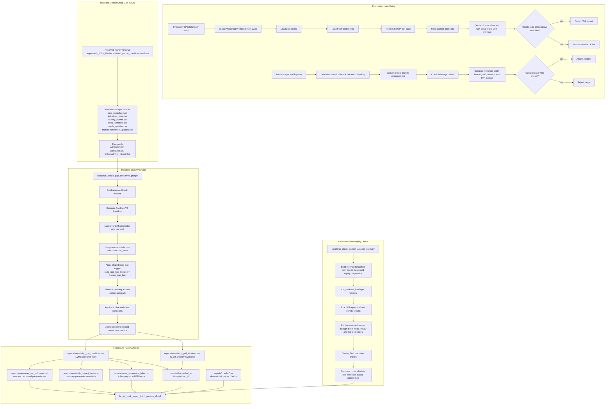

# System And Backtest Flow

This diagram matches the current May 2026 research bundle. It separates the on-chain hook paths from the two empirical pipelines used in the paper:

- the headline October 2025 stale-repricing sensitivity grid, and
- the observed-flow replay check used as supporting evidence.

The Dutch-auction path is a backtested/proposed repricing mechanism. The live Solidity hook currently exposes the synchronous fee override and liquidity-admission guards.

## Reading Notes

- The production hook path is synchronous: `beforeSwap` computes a fee override, while `beforeAddLiquidity` enforces centering and minimum-width admission.
- The headline empirical result comes from `script/run_oracle_gap_sensitivity_grid.py`, not the older one-page-proof pipeline.
- The auction trigger is the current pool-oracle stale gap in bps, not an absolute dollar threshold.
- The observed-flow replay is supporting evidence for the study machinery. It does not replace the October grid as the source of the recommended parameter set.
- The report bundle in `reports/` is the audit trail for what was tried and how the final paper figures and tables were produced.
