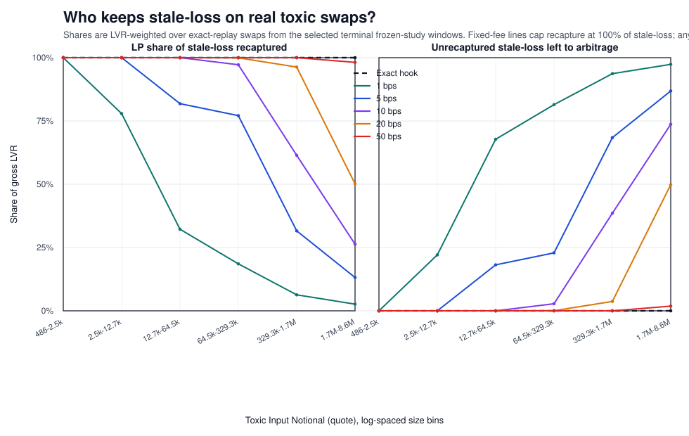

# One-Page Proof

**Fee identity holds to machine precision on real data.**

Across `44` replay-clean frozen windows (`7,019` swaps), every exact-replay fee-identity check passed. Maximum residual error on the exact series was `1.0e-64`.


## Curvature In The Observed Regime

Because the selected toxic swaps sit in a modest gap range, the exact law visually hugs the half-gap approximation in the main identity chart. This additional chart subtracts `x / 2` so the curvature is visible, while the bottom panel keeps the machine-precision fee-minus-LVR identity check.


## Split of Stale-Loss

This chart asks the economic question directly: for the stale-loss generated by real toxic swaps, how much ends up with LPs versus arbitrageurs under fixed fees, and where does the exact hook sit?

For size comparability, this proof chart stays within one pool family so toxic notionals share a single quote unit.



| Policy | Toxic-flow handling | 44-window result |
| --- | --- | --- |
| Baseline (`5 bps` fixed fee) | Flat fee, independent of oracle gap. | Underperforms the hook in `44 / 44` windows; median LP delta vs hook = `-2,652.39` quote. |
| Oracle-anchored hook | Charges the exact stale-loss recovery premium on toxic flow and fails closed above `maxFee`. | Reference policy for the study; fee identity passed in all `44 / 44` replay-clean windows. |
| Dutch auction | Only opens when solver execution beats the hook counterfactual. | Mean LP uplift vs hook = `+3.40` quote, 95% CI `[+0.93, +5.99]`; positive / zero / negative = `21 / 23 / 0`; mean trigger rate = `1.21%`. |

## Collateral Damage

| Hook collateral | Benign overcharge | Fee-cap rejections | Stale rejections |
| --- | --- | --- | --- |
| Aggregate | `0.000 bps` | `2,523` | `2` |
Mean toxic clip rate = `30.48%`; mean volume-loss rate = `28.88%`.

## Governance & Operational Path

| Item | Phase 1 | Phase 2 |
| --- | --- | --- |
| Operational path | Hook-only fee override via beforeSwap (deployed research hook). | Async auction relay with solver fills before fallback to hook (proposed). |
| Governance | Owner-set via setConfig(). | Recommended 48h timelock over auction parameters and fallback policy. |

Operational details and the proposed solver interface are documented in `../../docs/dutch_auction_operational_spec.md`.

Snapshot inputs and derived chart points are frozen in `proof_metrics.json`.

Regenerate with:

```bash
python3 -m script.generate_one_page_proof \
  --new-policy-dir .tmp/dutch_auction_ablation_artifact_build/new_policy \
  --study-summary study_artifacts/dutch_auction_ablation_2026_03_28/outputs/study_summary.json \
  --output-dir /Users/mitch/uni-v4-hook/uni-v4-hook/study_artifacts/one_page_proof_2026_03_31
```
